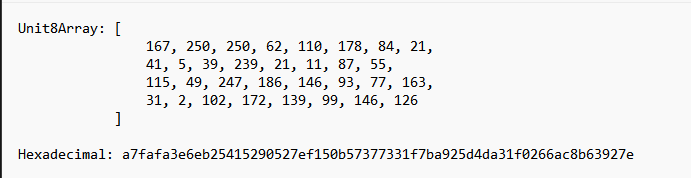
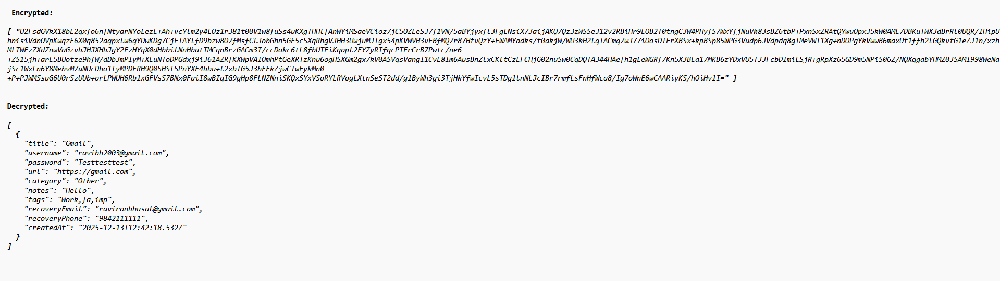
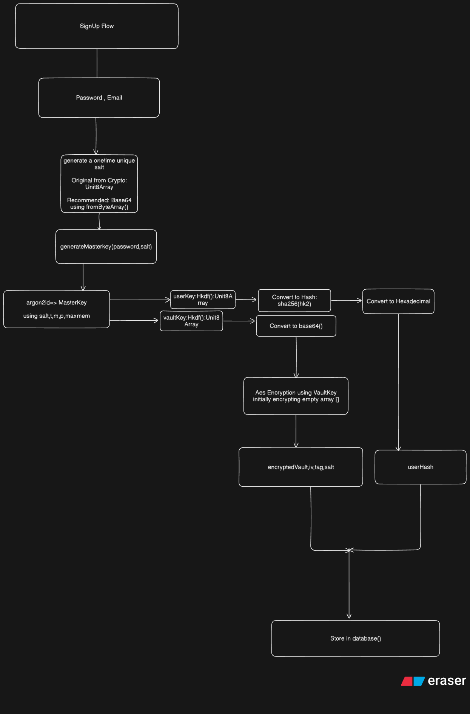
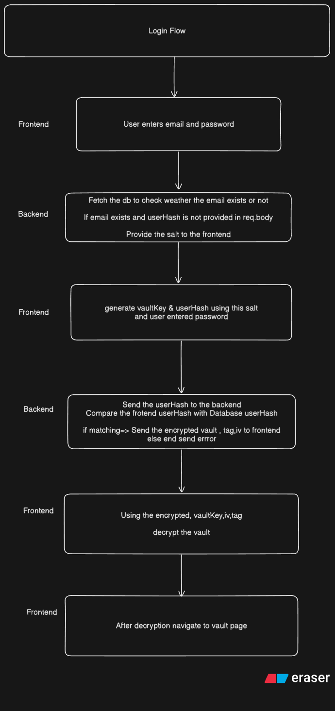
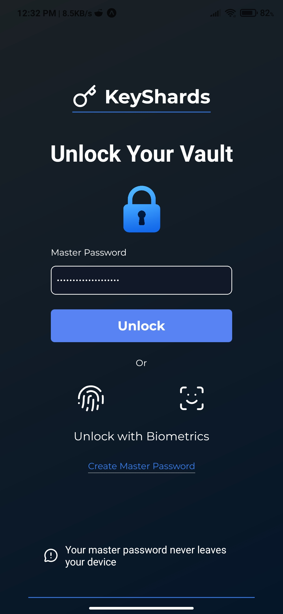
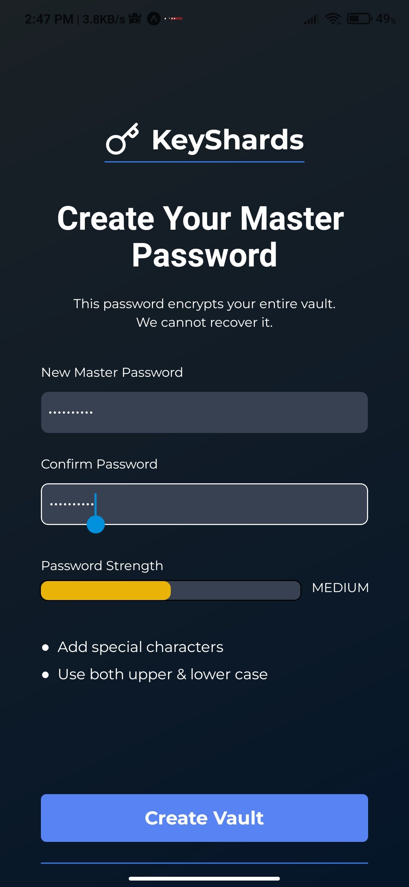
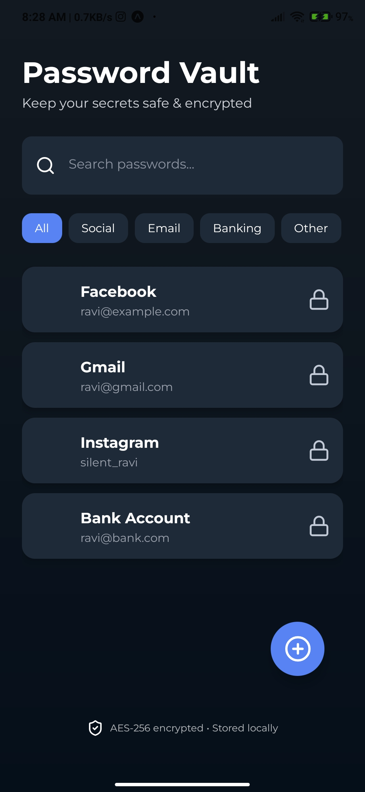
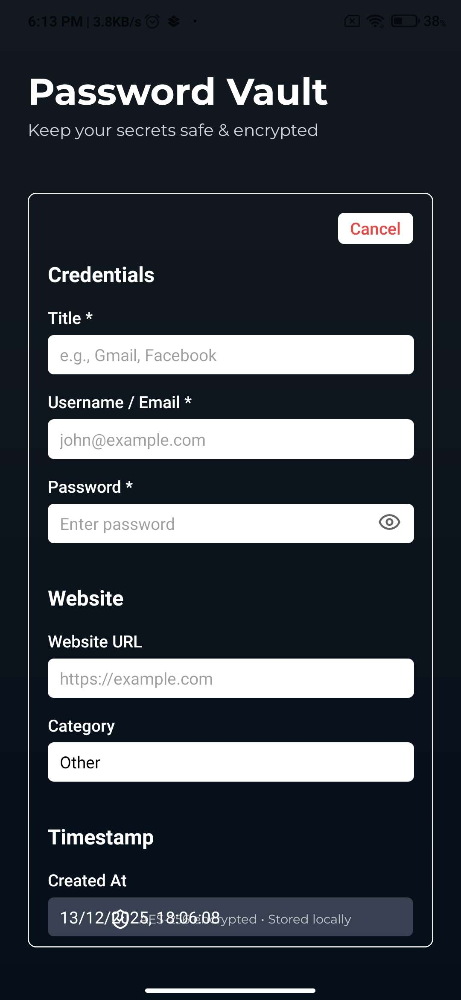

<div align="center">
  
  <h1>KeyShard</h1>
  <p><strong>A zero-knowledge, distributed password manager built for security and resilience.</strong></p>

  
  
  
  
  
  
  
</div>

---

## 📖 Table of Contents

- [What is KeyShard?](#-what-is-keyshard)
- [What Problem Does It Solve?](#-what-problem-does-it-solve)
- [Architecture](#-architecture)
- [System Design](#-system-design)
- [Security Model](#-security-model)
- [Tech Stack](#-tech-stack)
- [Requirements](#-requirements)
- [Getting Started](#-getting-started)
  - [1. Distributed Storage Nodes (Go)](#1-distributed-storage-nodes-go)
  - [2. Backend API (Node.js)](#2-backend-api-nodejs)
  - [3. Mobile App (React Native / Expo)](#3-mobile-app-react-native--expo)
  - [4. ML Password Strength Model (Python)](#4-ml-password-strength-model-python)
- [User Flows](#-user-flows)
- [App Screenshots](#-app-screenshots)
- [Environment Variables](#-environment-variables)
- [Contributing](#-contributing)

---

## 🔐 What is KeyShard?

**KeyShard** is a privacy-first, zero-knowledge password manager that combines:

- **Client-side encryption** using Argon2id + AES-GCM so your master key never leaves your device.
- **Distributed storage** across a ring of Go-powered nodes using consistent hashing, ensuring no single point of failure.
- **Machine-learning password strength analysis** to guide users toward truly secure passwords.
- **A cross-platform mobile app** built with React Native / Expo for iOS and Android.

Your passwords are encrypted on your device before they ever touch the network. The server stores only encrypted ciphertext — it has **zero knowledge** of your actual passwords or master key.

---

## ❓ What Problem Does It Solve?

Most password managers are centralized, closed-source, and trust the provider to never peek at your data. KeyShard eliminates that trust assumption:

| Problem | KeyShard's Solution |
|---|---|
| Central server compromise exposes all passwords | Vault data is AES-GCM encrypted before leaving the device |
| Single node failure takes the service down | Consistent-hash ring of 5 nodes with automatic key redistribution |
| Weak passwords accepted silently | On-device ML model (ONNX) rates password strength in real time |
| Master key stored on server | Argon2id derives the key on-device; it is never transmitted or persisted |
| Re-using IVs weakens AES security | A unique IV is generated per encryption operation |

---

## 🏗️ Architecture

### System Block Diagram


### Class Diagram


### Application Flowchart


### Process Model Architecture


---

## 📐 System Design

### Data Flow — Level 0


### Data Flow — Level 1


### Sequence Diagram


---

## 🔒 Security Model

KeyShard follows a **zero-knowledge architecture**:

1. **Argon2id Key Derivation** — Your master password is never stored. A 256-bit AES key is derived on-device using Argon2id with your account UUID as a unique salt.

   

2. **AES-GCM Vault Encryption** — The entire password vault is encrypted with AES-GCM. A fresh IV is generated for every encryption, so repeated saves of the same vault produce different ciphertext.

   

3. **On-device key lifetime** — The AES key lives only in memory during an active session. It is discarded when the app is locked or closed.

4. **Distributed storage** — Vault shards are distributed across a consistent-hash ring of Go nodes. Rebalancing happens automatically when nodes join or leave, with no data loss.

### Key lifecycle summary

```
Master Password + UUID (salt)
        │
        ▼  Argon2id (on device)
   AES-256 Master Key  ──────────────────┐
        │                                │
        ▼                                ▼
  Encrypt Vault (AES-GCM)         Decrypt Vault (AES-GCM)
        │                                │
        ▼                                ▼
  [Ciphertext + IV]  ──► API ──►  [Ciphertext + IV]
     (stored in DB)                (returned from DB)
```

---

## 🛠️ Tech Stack

| Layer | Technology |
|---|---|
| Mobile App | React Native, Expo, NativeWind (Tailwind), Expo Router |
| Client Crypto | `@noble/hashes` (Argon2id), `react-native-aes-gcm-crypto` |
| Backend API | Node.js, Express 5, MongoDB (Mongoose), Redis, Helmet, Winston |
| Distributed Nodes | Go 1.24, bbolt (embedded DB), consistent hashing (`buraksezer/consistent`) |
| ML / AI | Python, scikit-learn, XGBoost, TensorFlow, ONNX, SHAP |
| Infrastructure | Docker, Docker Compose |

---

## 📋 Requirements

### Global

| Tool | Version |
|---|---|
| Docker | 24+ |
| Docker Compose | v2+ |
| Node.js | 20+ |
| Go | 1.24+ |
| Python | 3.10+ |
| Expo CLI | Latest |

### Mobile App

- Android Studio **or** Xcode (for native builds)
- A physical device or emulator/simulator
- Expo Go app (for quick development)

### Backend Services

- MongoDB instance (Atlas or local)
- Redis instance (Cloud or local)

---

## 🚀 Getting Started

### 1. Distributed Storage Nodes (Go)

The Go layer runs a 5-node consistent-hash ring. Each node stores an embedded bbolt database.

**Start all 5 nodes with Docker Compose (recommended):**

```bash
docker-compose up --build
```

Node ports exposed on `localhost`:

| Node | Host Port |
|---|---|
| node1 | 8001 |
| node2 | 8002 |
| node3 | 8003 |
| node4 | 8004 |
| node5 | 8005 |

**Run a single node manually:**

```bash
go build -o keyshard ./cmd/keyshard-node
./keyshard -config=node1.yaml
```

Node configuration lives in `node1.yaml` – `node5.yaml`. Edit these files to change node IDs, addresses, and peer lists.

---

### 2. Backend API (Node.js)

```bash
cd backend

# 1. Copy and fill in environment variables
cp .env.example .env

# 2. Install dependencies
npm install

# 3. Start in development mode (auto-reload)
npm run dev

# 4. Or start in production mode
npm start
```

The API server starts on the port defined in your `.env` file.

---

### 3. Mobile App (React Native / Expo)

```bash
cd mobileApp

# 1. Install dependencies
npm install

# 2. Start the Expo development server
npm start         # opens Expo Dev Tools

# Run on a specific platform
npm run android   # requires Android Studio / emulator
npm run ios       # requires Xcode / simulator (macOS only)
npm run web       # runs in browser (limited native features)
```

> **Tip:** Scan the QR code with the **Expo Go** app on your phone for the fastest iteration loop.

---

### 4. ML Password Strength Model (Python)

```bash
cd ML

# Create and activate a virtual environment
python -m venv .venv
source .venv/bin/activate   # Windows: .venv\Scripts\activate

# Install dependencies
pip install -r requirements.txt

# Run notebooks or training scripts
jupyter notebook notebooks/
```

The trained model is exported as an ONNX file and bundled with the mobile app for fully on-device inference.

---

## 🔄 User Flows

### Sign-Up Flow



### Login Flow



---

## 📱 App Screenshots

<table>
  <tr>
    <td align="center"><strong>Sign In</strong></td>
    <td align="center"><strong>Sign Up</strong></td>
    <td align="center"><strong>Home / Vault</strong></td>
  </tr>
  <tr>
    <td></td>
    <td></td>
    <td></td>
  </tr>
</table>

### Password Entry Form



---

## 🌐 Environment Variables

### Backend (`backend/.env`)

| Variable | Description |
|---|---|
| `PORT` | Port the Express server listens on |
| `MONGO_URL` | MongoDB connection string |
| `REDIS_USERNAME` | Redis username |
| `REDIS_PASSWORD` | Redis password |
| `REDIS_HOST` | Redis hostname |
| `REDIS_PORT` | Redis port |

Copy `backend/.env.example` to `backend/.env` and fill in the values before starting the backend.

---

## 🤝 Contributing

1. Fork the repository.
2. Create a feature branch: `git checkout -b feature/your-feature`.
3. Commit your changes: `git commit -m "feat: add your feature"`.
4. Push the branch: `git push origin feature/your-feature`.
5. Open a Pull Request against `main`.

Please follow the existing code style and include relevant tests where applicable.

---

<div align="center">
  <sub>Built with ❤️ — zero knowledge, maximum security.</sub>
</div>
